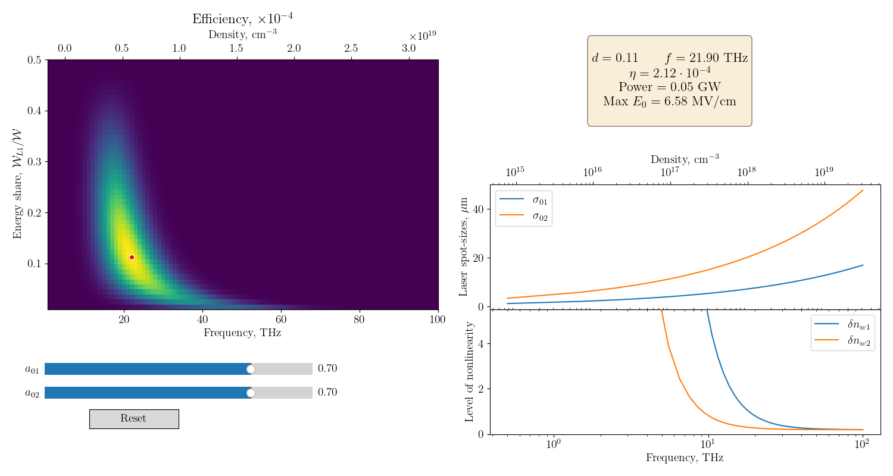

# Library for calculating parameters of $2\omega_p$ radiation generated by counter-propagating lasers in plasma

Radiation is the result of nonlinear interaction of counterpropagating plasma wakes excited in a uniform plasma by short laser drivers with equal wavelengths.  In a homogeneous
plasma, purely potential Langmuir waves are excited by these drivers.
Scattering of the first potential wave (which perturbs the longitudinal velocity $\delta v_{1x}$ ) on the density modulation
$\delta n_2$ produced by the second wave (and vice versa) results in forced oscillations of the longitudinal electric current $\mathcal{J} \propto \delta n_2 \delta v_{1x} + \delta n_1 \delta v_{2x}$ at the doubled plasma frequency
$$
(k_1, \omega_p) + (- k_2, \omega_p) \rightarrow (k_1 - k_2, 2 \omega_p).
$$

To know more about the mechanism follow:
- [**Generation of high-field narrowband terahertz radiation by counterpropagating plasma wakefields**](https://doi.org/10.1063/1.4993100)
- [**Simulations of electromagnetic emission from colliding laser wakefields**](https://doi.org/10.1088/1361-6587/ab74e6)
- [**Optimal synchronization of laser pulses in THz generation scheme with colliding plasma wakes**](https://doi.org/10.1063/5.0029848)

Files:
- `libdimparam.py` - physical constants and functions for converting variables to dimensional quantities
- `libradiationproperties.py` - basic formular for radiation properties: electric field amplitude, radiation power and efficiency
- `libenergy.py` - extension for considering an energy share between lasers
- `libPlot.py` - functions to make additional operations and plot the grap
- `search_parameters.py` - an example of use

<figure>
    
   <figcaption>Output of the script</figcaption> 
   </figure>

The figure is interactive. One can vary values of $a_{01}$, $a_{02}$ and move a point on the efficiency map with other plots as well as parameters in the box being recalculating.

Necessary python modules:
- matplotlib
- numpy
- scipy
- multiprocessing
- functools

To see generated $\LaTeX$ formula in comments use [Mathover extension for VS code](https://github.com/yousefvand/mathover).